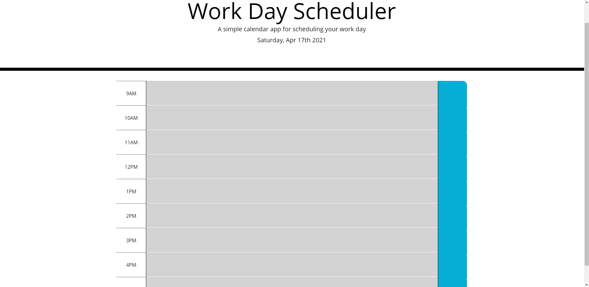

# Work-Day-Scheduler
## Description
* User has ability to insert a task that needs to be done throughout the day at any time block they choose.
* All tasks are saved to local storage.
* Red blocks are for current hour.
* green blocks are to indicate future tasks.
* grey blocks indicate past time.
## Screenshot

## Links
[deployed](https://jacobduden.github.io/Work-Day-Scheduler/)

[github](https://github.com/jacobduden/Work-Day-Scheduler)